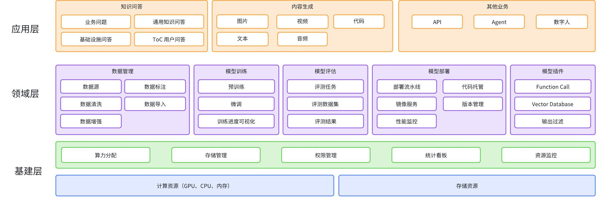
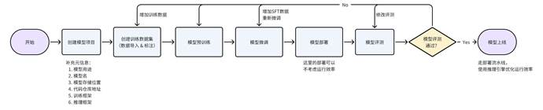
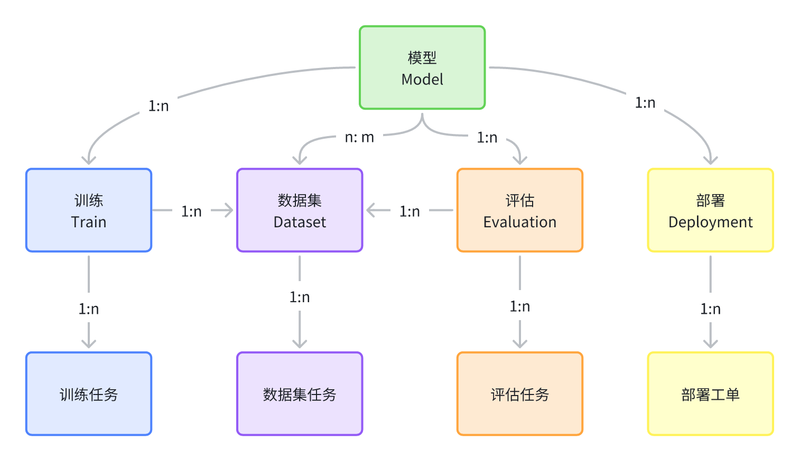
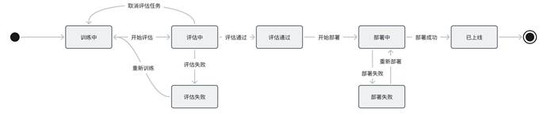
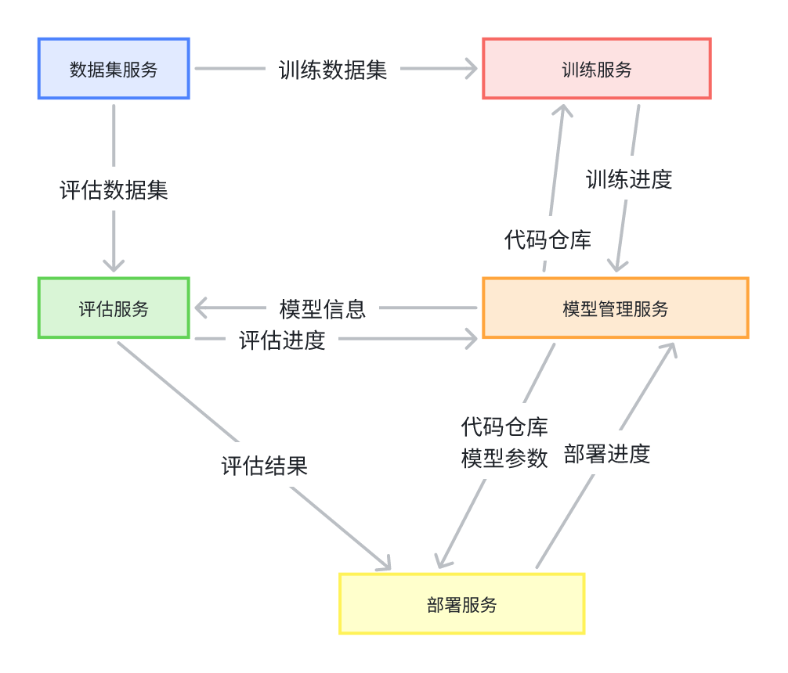
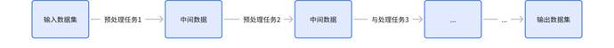

# （**WIP**）大模型平台技术方案

 

## 1. 需求

为**垂直领域**大模型应用提供模型训练、模型推理、模型部署和测评、模型管理、资源调度等工程解决方案

 

## 2. 总体设计

 

模型从开发到部署上线的全流程

 

### 2.1 领域模型

  整个平台分为几个域，每个域有哪些关键模型  

 

模型：对模型开发进度的追踪

训练：记录模型训练时使用的各种信息，如使用的数据集，各种超参数配置（？）

训练任务：记录一次实际的训练过程，应该包含训练结果

评估：配置模型如何进行评估，人工 or 自动评估

评估任务：记录一次实际的评估过程，包含评估过程中模型的实际输入输出内容

部署：包含一系列可配置参数，描述如何进行部署

部署任务：是部署的一次执行实例

数据集：记录数据集的元数据，对数据的描述、版本、来源、类型（文本 or 图 or 视频）、秘密程度分级

数据集任务：对数据集执行的一系列操作，如数据清洗、转换、分割、增强等

 

#### 2.1.1 状态机

•     模型

[ ] 模型的状态机是否用于卡上线流程？（评估没通过不允许部署？）

 

•     任务

 

### 2.2 **系统架构**

#### 2.2.1 **调用关系**

 

 

## 3. **详细设计**

### 3.1 **数据管理**

### 3.1.1 **数据集管理**

•     开源数据

- 平台内置

•     数据导入

-    文件导入

-    链接导入

-    HDFS导入

#### 3.1.2 **可视化**

 

 

#### 3.1.3 **数据集预处理**

创建数据清洗任务，配置数据清洗规则（内置部分常用规则，支持编写个性化清洗规则）

 

##### 3.1.3.1 **数据清洗任务**

•     网页数据去除html tag

•     去除不合规数据

•     去除低质量数据

•     去除重复数据

 

##### 3.1.3.2 **数据增强任务**

•     图片，对图片进行一系列处理形成新的图片来增加多样性和数据量。（e.g. 旋转，加噪声，缩放，裁剪...）

•     文本，同义词替换，随机插入，拼写错误...

•     音频，变调，加速，加噪声...

•     视频

-    帧间增强，同图片的增强

-    帧内增强，跳帧，重复帧

-    音频增强，同音频的增强

 

#### 3.1.4 **数据标注**

支持多种标注方式，可以配置成模板复用

•     图片

-    圈选出一块或多块区域并标记

-    用文本描述图片

•     视频

-    用文本描述视频

•     文本

-    导入问答对（指令、输入、输出）

•     音频

-    识别成文字

 

### 3.2 **模型推理**

知识盲区

 

### 3.3 **模型测评**

#### 3.3.1 **测试数据集管理**

#### 3.3.2 **评测任务管理**

支持多版本Prompt的评测结果对比？

 

#### 3.3.3 **模型竞技场**

多个模型同时生成一张图片或视频，人工选最优

 

### 3.4 **模型部署**

使用部署流水线解决模型部署的问题

PyTorch/TensorFlow编写的模型 -> 转化成中间表示ONNX -> 推理引擎( ONNX Runtime / Tensor RT) -> 打包成docker镜像 -> 部署到计算节点上

#### 3.4.1 **云端部署**

#### 3.4.2 **边缘部署**

 

### 3.5 **模型管理**

跟踪每个模型的开发进度

 

#### 3.5.1 **监控**

性能，QPS，RT P99

 

### 3.6 **资源调度**

#### 3.6.1 **成本看板**

 

 