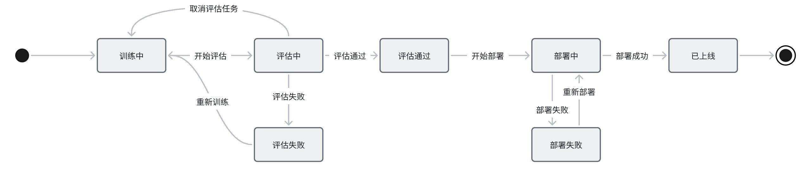
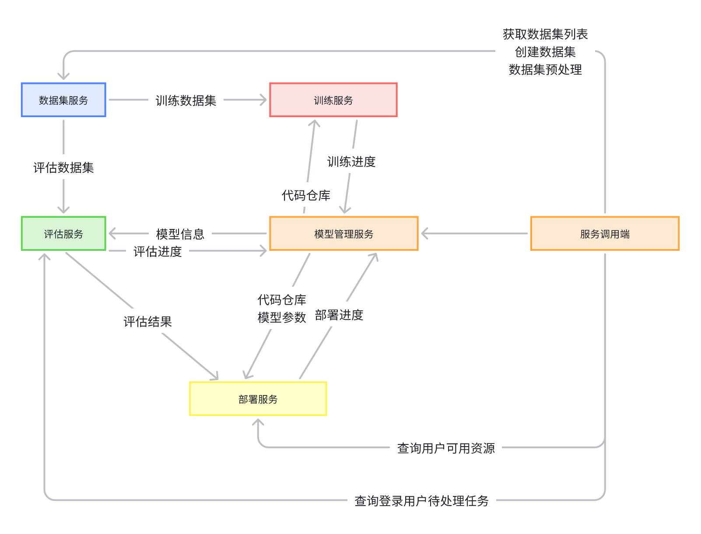

# （**WIP**）大模型平台技术方案

 

## 1. 需求

为**垂直领域**大模型应用提供模型训练、模型推理、模型部署和测评、模型管理、资源调度等工程解决方案

 

## 2. 总体设计


 

模型从开发到部署上线的全流程


 

### 2.1 领域模型

  整个平台分为几个域，每个域有哪些关键模型  


 

**模型**：记录模型的相关元数据，跟踪模型开发进度，将其他领域模型串联

**训练**：记录模型训练时使用的各种信息，如使用的数据集，各种超参数配置（？）

**训练任务**：记录一次实际的训练过程，应该包含训练结果

**评估**：配置模型如何进行评估，人工 or 自动评估，使用哪些数据集

**评估任务**：记录一次实际的评估过程，包含评估过程中模型的实际输入输出内容

**部署**：包含一系列可配置参数，描述如何进行部署

**部署工单**：是部署的一次执行实例

**数据集**：记录数据集的元数据，对数据的描述、版本、来源、类型（文本 or 图 or 视频）、秘密程度分级

**数据集任务**：对数据集执行的一系列操作，如数据清洗、转换、分割、增强等

 

### 2.2 状态机

•     模型

[ ] 模型的状态机是否用于卡上线流程？（评估没通过不允许部署？）



 

•     任务


### 2.3 领域服务
> 每个域对外提供什么能力

#### 2.3.1 模型域
- 创建一个模型项目（填写元数据）
- 查询模型信息（同时将训练状态，评估状态，部署状态查出来）
- 创建评估配置（使用的数据集，评估方式等）
- 创建部署配置（设置实例CPU，GPU，内存大小、机房位置等）

#### 2.3.2 数据集域
- 创建一个数据集
- 创建数据集预处理任务
- 创建数据标注任务（支持众包）
- 

#### 2.3.3 训练域
- 

#### 2.3.4 评估域
- 创建一个评估任务
- 返回评估结果

#### 2.3.5 部署域
- 启动一个部署工单
- 获取部门或个人的资源Quota
- 设置部门或个人的资源Quota

 
### 2.4 **系统架构**

#### 2.4.1 **调用关系**




## 3. **详细设计**

### 3.1 **数据管理**

#### 3.1.1 **数据集管理**


•     数据导入

-    文件导入

-    链接导入（如开源数据集）

-    HDFS导入

#### 3.1.2 **可视化**
 

 

#### 3.1.3 **数据集预处理**

创建数据清洗任务，配置数据清洗规则（内置部分常用规则，支持编写个性化清洗规则）


 

##### 3.1.3.1 **数据清洗任务**

•     网页数据去除html tag

•     去除不合规数据

•     去除低质量数据

•     去除重复数据

 

##### 3.1.3.2 **数据增强任务**

•     图片，对图片进行一系列处理形成新的图片来增加多样性和数据量。（e.g. 旋转，加噪声，缩放，裁剪...）

•     文本，同义词替换，随机插入，拼写错误...

•     音频，变调，加速，加噪声...

•     视频

-    帧间增强，同图片的增强

-    帧内增强，跳帧，重复帧

-    音频增强，同音频的增强

 

#### 3.1.4 **数据标注**

支持多种标注方式，可以配置成模板复用

•     图片

-    圈选出一块或多块区域并标记

-    用文本描述图片

•     视频

-    用文本描述视频

•     文本

-    导入问答对（指令、输入、输出）

-    情感分析

•     音频

-    识别成文字

 

### 3.2 **模型推理**


 

### 3.3 **模型测评**

#### 3.3.1 **测试数据集管理**
> 每年考个搏学考试

#### 3.3.2 **评测任务管理**

支持多版本Prompt的评测结果对比？

 

#### 3.3.3 **模型竞技场**

多个模型同时生成一张图片或视频，人工选最优

 

### 3.4 **模型部署**

使用部署流水线解决模型部署的问题

PyTorch/TensorFlow编写的模型 -> 转化成中间表示ONNX -> 推理引擎( ONNX Runtime / Tensor RT) -> 打包成docker镜像 -> 部署到计算节点上

#### 3.4.1 **部署流水线**


#### 3.4.2 **资源管理**

#### 3.4.3 **成本看板**


### 3.5 **模型管理**

跟踪每个模型的开发进度


#### 3.5.1 **表结构**
 
模型表
```sql
CREATE TABLE model_project (
    id bigint PRIMARY KEY,
    name VARCHAR(100) NOT NULL COMMENT '模型项目名',
    desc VARCHAR(1000) DEFAULT NULL COMMENT '描述',
    path VARCHAR(200) DEFAULT NULL COMMENT '模型路径',
    train_framework VARCHAR(100) DEFAULT NULL COMMENT '训练框架',
    Inference_framework VARCHAR(100) DEFAULT NULL COMMENT '推理框架',
    metrics_url VARCHAR(200) DEFAULT NULL COMMENT '监控看板url',
);
```

评测任务表

部署配置表

部署工单表

#### 3.5.2 **监控**

性能，QPS，RT P99

 


## 4. 上线/回滚/灰度方案

### 4.1 上线方案

### 4.2 回滚方案

### 4.3 灰度方案


## 5. Reference

1. https://qianfan.cloud.baidu.com/