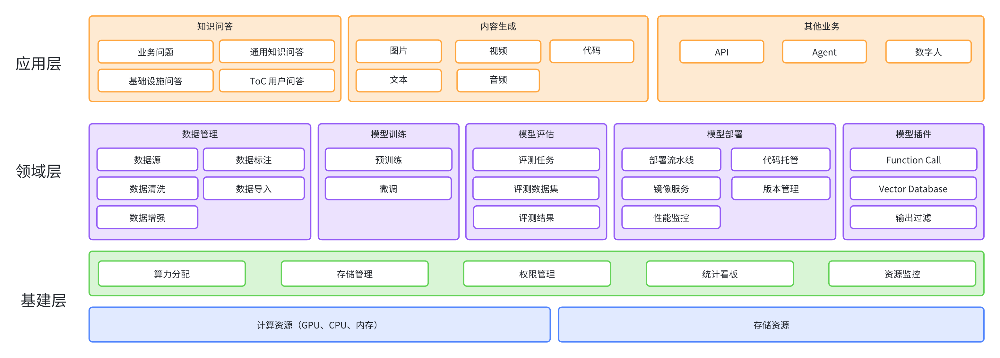
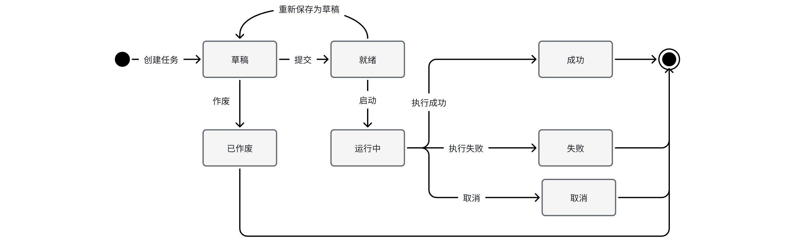
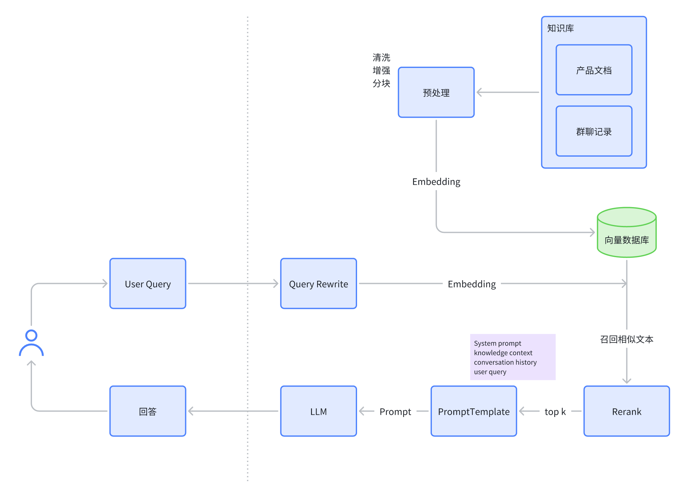

# （**WIP**）大模型平台技术方案

 

## 1. 相关信息

### 1.1 需求

为**垂直领域**大模型应用提供模型训练、模型推理、模型部署和测评、模型管理、资源调度等工程解决方案

 

## 2. 总体设计



 

模型从开发到部署上线的全流程


 

### 2.1 领域模型

  整个平台分为几个域，每个域有哪些关键模型  


 

**模型**：记录模型的相关元数据，跟踪模型开发进度，将其他领域模型串联

**训练**：记录模型训练时使用的各种信息，如使用的数据集，各种超参数配置（？）

**训练任务**：记录一次实际的训练过程，应该包含训练结果

**评估**：配置模型如何进行评估，人工 or 自动评估，使用哪些数据集，量化模型的表现以判断模型版本更新的收益

**评估任务**：记录一次实际的评估过程，包含评估过程中模型的实际输入输出内容

**部署**：包含一系列可配置参数，描述如何进行部署

**部署工单**：是部署的一次执行实例

**数据集**：记录数据集的元数据，对数据的描述、版本、来源、类型（文本 or 图 or 视频）、秘密程度分级

**数据集任务**：对数据集执行的一系列操作，如数据清洗、转换、分割、增强等

 

### 2.2 状态机

•     模型

[ ] 模型的状态机是否用于卡上线流程？（评估没通过不允许部署？）


 

•     任务




### 2.3 领域服务
> 每个域对外提供什么能力

#### 2.3.1 模型域
- 创建一个模型项目（填写元数据）
- 查询模型信息（同时将训练状态，评估状态，部署状态查出来）
- 创建评估配置（使用的数据集，评估方式等）
- 创建部署配置（设置实例CPU，GPU，内存大小、机房位置等）

#### 2.3.2 数据集域
- 创建一个数据集
- 创建数据集预处理任务
- 创建数据标注任务（支持众包）


#### 2.3.3 训练域


#### 2.3.4 评估域
- 创建一个评估任务（任务应该有某种分配规则，将任务自动分配给一批评测员和质检员）
- 获取登录用户待处理的评估/质检任务
- 返回模型的评估结果

#### 2.3.5 部署域
- 创建模型的部署配置
- 启动一个部署工单
- 获取部门或个人的资源Quota
- 设置部门或个人的资源Quota

 
### 2.4 **系统架构**

#### 2.4.1 **调用关系**


## 3. **详细设计**

### 3.1 **数据管理**

#### 3.1.1 **数据集管理**


•     数据集导入 / 删除

-    文件导入

-    链接导入（如开源数据集）

-    HDFS导入（记录地址即可）

•    数据集权限管理


#### 3.1.2 **数据集预处理**

创建数据清洗任务，配置数据清洗规则（内置部分常用规则，支持编写个性化清洗规则）


 

##### 3.1.2.1 **数据清洗任务**

•     网页数据去除html tag

•     去除不合规数据

•     去除低质量数据

•     去除重复数据

•     自定义任务
 

##### 3.1.2.2 **数据增强任务**

•     图片，对图片进行一系列处理形成新的图片来增加多样性和数据量。（e.g. 旋转，加噪声，缩放，裁剪...）

•     文本，同义词替换，随机插入，拼写错误...

•     音频，变调，加速，加噪声...

•     视频

-    帧间增强，同图片的增强

-    帧内增强，跳帧，重复帧

-    音频增强，同音频的增强

 

#### 3.1.3 **数据标注**

支持多种标注方式，可以配置成模板复用

•     图片

-    圈选出一块或多块区域并标记

-    用文本描述图片

•     视频

-    用文本描述视频

•     文本

-    导入问答对（指令、输入、输出）

-    情感分析

•     音频

-    识别成文字

 
#### 3.1.4 **可视化**
使用公司已有的基础设施实现


#### 3.1.5 表结构
数据集
```sql
CREATE TABLE dataset (
    `id` bigint(20) unsigned NOT NULL COMMENT 'id',
    `name` VARCHAR(100) NOT NULL COMMENT '数据集名称',
    `desc` VARCHAR(1000) DEFAULT NULL COMMENT '描述',
    `type` int(11) DEFAULT NULL COMMENT '数据集类型，图像/文本/...',
    `project_space_id` bigint(20) NOT NULL COMMENT '空间id，如需要控制可见性可使用',
    `file_url` VARCHAR(1000) NOT NULL COMMENT '数据集地址，以基础架构支持为准', 
    `version` int(11) NOT NULL DEFAULT 0 COMMENT '版本锁',
    `mark_delete` tinyint(4) NOT NULL DEFAULT 0 COMMENT '删除标',
    `create_time` bigint(20) NOT NULL DEFAULT 0 COMMENT '创建时间戳',
    `update_time` bigint(20) NOT NULL DEFAULT 0 COMMENT '更新时间戳',
    PRIMARY KEY (`id`),
) ENGINE=InnoDB DEFAULT CHARSET=utf8mb4 COMMENT='数据集表';
```

数据集处理任务
```sql
CREATE TABLE dataset_task (
    `id` bigint(20) unsigned NOT NULL COMMENT 'id',
    `name` VARCHAR(100) NOT NULL COMMENT '任务名',
    `desc` VARCHAR(1000) DEFAULT NULL COMMENT '描述',
    `type` int(11) NOT NULL COMMENT '任务类型，清洗/增强/标注',
    `sub_type` int(11) DEFAULT NULL COMMENT '任务子类型',
    `status` int(11) DEFAULT NULL COMMENT '状态',
    `version` int(11) NOT NULL DEFAULT 0 COMMENT '版本锁',
    `mark_delete` tinyint(4) NOT NULL DEFAULT 0 COMMENT '删除标',
    `create_time` bigint(20) NOT NULL DEFAULT 0 COMMENT '创建时间戳',
    `update_time` bigint(20) NOT NULL DEFAULT 0 COMMENT '更新时间戳',
    PRIMARY KEY (`id`),
) ENGINE=InnoDB DEFAULT CHARSET=utf8mb4 COMMENT='数据集处理任务表';
```

#### 3.1.6 IDL
```thrift
enum DatasetType {
    Image = 1,
    Text = 2,
    Video = 3
}

// 数据集任务类型
enum DatasetTaskType {
    Cleaning = 1000,        // 数据清洗
    Augmentation = 2000,    // 数据增强
    Annotation = 3000,      // 数据标注
}


// 数据集任务子类型
enum DatasetTaskSubType {
    Bounding_Box_Annotation = 3001, // 区域标注
    Image_Description = 3002,       // 图像描述
    Video_Description = 3003,       // 视频描述
    Sentiment_Analysis = 3004,      // 情感分析
    Speech_Recognition = 3005,      // 音频转文本
}
```

### 3.2 **模型推理**


 

### 3.3 **模型测评**

#### 3.3.1 **测试数据集管理**


#### 3.3.2 **评测任务管理**

支持多版本Prompt的评测结果对比？

如果是人工评测，需要把评测任务分配给评测员，需质检
 

#### 3.3.3 **模型竞技场**

多个模型同时生成一张图片或视频，人工选最优

 

### 3.4 **模型部署**

使用部署流水线解决模型部署的问题

PyTorch/TensorFlow编写的模型 -> 转化成中间表示ONNX -> 推理引擎( ONNX Runtime / Tensor RT) -> 打包成docker镜像 -> 部署到计算节点上

#### 3.4.1 **部署流水线**


#### 3.4.2 **资源管理**

#### 3.4.3 **成本看板**

#### 3.4.4 **表结构**

部署配置表
```sql
CREATE TABLE deployment_config (
    `id` bigint(20) unsigned NOT NULL COMMENT 'id',
    `name` VARCHAR(100) NOT NULL COMMENT '模型项目名',
    `desc` VARCHAR(1000) DEFAULT NULL COMMENT '描述',
    `model_id` bigint(20) NOT NULL COMMENT '模型id',
    `config` JSON DEFAULT NULL COMMENT '部署配置',
    `version` int(11) NOT NULL DEFAULT 0 COMMENT '版本锁',
    `mark_delete` tinyint(4) NOT NULL DEFAULT 0 COMMENT '删除标',
    `create_time` bigint(20) NOT NULL DEFAULT 0 COMMENT '创建时间戳',
    `update_time` bigint(20) NOT NULL DEFAULT 0 COMMENT '更新时间戳',
    PRIMARY KEY (`id`),
) ENGINE=InnoDB DEFAULT CHARSET=utf8mb4 COMMENT='部署配置表';
```

部署工单表
```sql
CREATE TABLE deplyment_session (
    `id` bigint(20) unsigned NOT NULL COMMENT 'id',
    `name` VARCHAR(100) NOT NULL COMMENT '模型项目名',
    `desc` VARCHAR(1000) DEFAULT NULL COMMENT '描述',
    `deplyment_config_id` bigint(20) NOT NULL COMMENT '部署配置id',
    `config` JSON DEFAULT NULL COMMENT '部署配置快照',
    `version` int(11) NOT NULL DEFAULT 0 COMMENT '版本锁',
    `mark_delete` tinyint(4) NOT NULL DEFAULT 0 COMMENT '删除标',
    `create_time` bigint(20) NOT NULL DEFAULT 0 COMMENT '创建时间戳',
    `update_time` bigint(20) NOT NULL DEFAULT 0 COMMENT '更新时间戳',
    PRIMARY KEY (`id`),
) ENGINE=InnoDB DEFAULT CHARSET=utf8mb4 COMMENT='部署工单表';
```


### 3.5 **模型管理**

跟踪模型的开发进度


#### 3.5.1 **表结构**
 
模型表
```sql
CREATE TABLE model_project (
    `id` bigint(20) unsigned NOT NULL COMMENT 'id',
    `name` VARCHAR(100) NOT NULL COMMENT '模型项目名',
    `desc` VARCHAR(1000) DEFAULT NULL COMMENT '描述',
    `path` VARCHAR(200) DEFAULT NULL COMMENT '模型路径',
    `train_framework` VARCHAR(100) DEFAULT NULL COMMENT '训练框架',
    `Inference_framework` VARCHAR(100) DEFAULT NULL COMMENT '推理框架',
    `metrics_url` VARCHAR(200) DEFAULT NULL COMMENT '监控看板url',
    `status` int(11) NOT NULL DEFAULT 0 COMMENT '状态', 
    `code_repo_url` VARCHAR(200) DEFAULT NULL COMMENT '代码仓库url',
    `hdfs_dir` VARCHAR(200) DEFAULT NULL COMMENT '模型文件url',
    `version` int(11) NOT NULL DEFAULT 0 COMMENT '版本锁',
    `mark_delete` tinyint(4) NOT NULL DEFAULT 0 COMMENT '删除标',
    `create_time` bigint(20) NOT NULL DEFAULT 0 COMMENT '创建时间戳',
    `update_time` bigint(20) NOT NULL DEFAULT 0 COMMENT '更新时间戳',
    PRIMARY KEY (`id`),
) ENGINE=InnoDB DEFAULT CHARSET=utf8mb4 COMMENT='模型表';
```

#### 3.5.2 **监控**

性能，QPS，RT P99


### 3.6 应用层
#### 3.6.1 知识问答



问答两种方式
- 大模型直接回答用户
- 大模型将回答返回给人工客服（对用户不可见），人工客服决定是否采纳大模型的回答（人工客服的采纳情况可以作为优化大模型的数据源）

优化方向
  - 改进LLM
  - 知识提取
  - 知识召回质量

- To B
  - 私有知识库可配置化
  - 多租户（支持多业务方接入 SaaS化）
  - Prompt和模型支持自定义
  - Function Call和db支持
  - 无缝接入企业IM工具

- To C
  - 价值观对齐（防止输出不当言论）
  - 输出内容的准确性（无法回答 > 错误回答），附上知识来源链接
  - 性能（优化输出的速度，同时降低成本）
  - 输出内容多样性、美化
  - 支持分享到社交工具

#### 3.6.2 内容生成

文本生成

代码生成

图片生成

视频 + 音频 生成

### 3.6.3 Agent

自动化执行复杂任务，充分挖掘LLM的潜力


## 4. 上线/回滚/灰度方案

### 4.1 上线方案

### 4.2 回滚方案

### 4.3 灰度方案


## 5. References

1. https://qianfan.cloud.baidu.com/